# [📈 Live Status](https://uptime.kind.work): <!--live status--> **🟧 Partial outage**

This repository contains the open-source uptime monitor and status page for [Kind.Work](https://uptime.kind.work), powered by [Upptime](https://github.com/upptime/upptime).

With [Upptime](https://upptime.js.org), you can get your own unlimited and free uptime monitor and status page, powered entirely by a GitHub repository. We use [Issues](https://github.com/kind-work/uptime/issues) as incident reports, [Actions](https://github.com/kind-work/uptime/actions) as uptime monitors, and [Pages](https://uptime.kind.work) for the status page.

<!--start: status pages-->
<!-- This summary is generated by Upptime (https://github.com/upptime/upptime) -->
<!-- Do not edit this manually, your changes will be overwritten -->
<!-- prettier-ignore -->
| URL | Status | History | Response Time | Uptime |
| --- | ------ | ------- | ------------- | ------ |
|  [Agri Food Hub](https://agrifoodhub.org) | 🟩 Up | [agri-food-hub.yml](https://github.com/kind-work/uptime/commits/HEAD/history/agri-food-hub.yml) | 

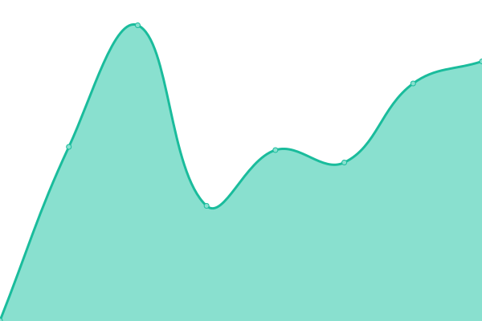 726ms
     
 | 

<a href="https://uptime.kind.work/history/agri-food-hub">100.00%</a>
    

|  [Avery Peters](https://averypeters.ca) | 🟩 Up | [avery-peters.yml](https://github.com/kind-work/uptime/commits/HEAD/history/avery-peters.yml) | 

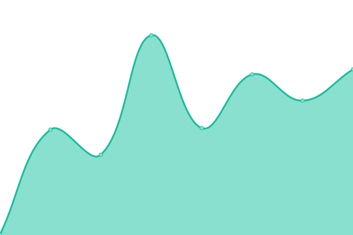 332ms
     
 | 

<a href="https://uptime.kind.work/history/avery-peters">100.00%</a>
    

|  [Canadian Catholic](https://canadiancatholic.net) | 🟩 Up | [canadian-catholic.yml](https://github.com/kind-work/uptime/commits/HEAD/history/canadian-catholic.yml) | 

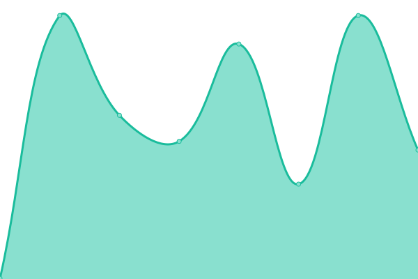 318ms
     
 | 

<a href="https://uptime.kind.work/history/canadian-catholic">100.00%</a>
    

|  [Cindy Thompson](https://cindythompson.ca) | 🟩 Up | [cindy-thompson.yml](https://github.com/kind-work/uptime/commits/HEAD/history/cindy-thompson.yml) | 

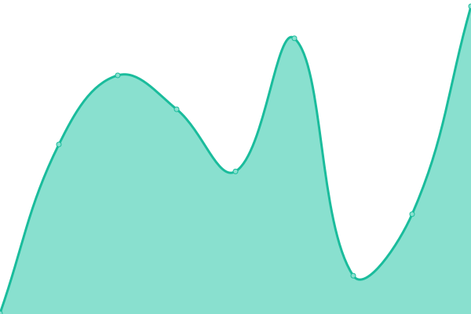 322ms
     
 | 

<a href="https://uptime.kind.work/history/cindy-thompson">100.00%</a>
    

|  [Humber Valley Triathlon](https://hvtri.ca) | 🟩 Up | [humber-valley-triathlon.yml](https://github.com/kind-work/uptime/commits/HEAD/history/humber-valley-triathlon.yml) | 

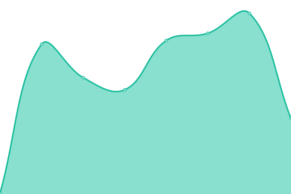 263ms
     
 | 

<a href="https://uptime.kind.work/history/humber-valley-triathlon">100.00%</a>
    

|  [Level Justice](https://leveljustice.org) | 🟥 Down | [level-justice.yml](https://github.com/kind-work/uptime/commits/HEAD/history/level-justice.yml) | 

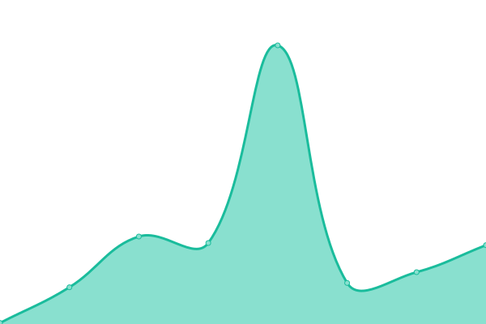 111ms
     
 | 

<a href="https://uptime.kind.work/history/level-justice">100.00%</a>
    

|  [David Cohlmeyer](https://davidcohlmeyer.ca) | 🟩 Up | [david-cohlmeyer.yml](https://github.com/kind-work/uptime/commits/HEAD/history/david-cohlmeyer.yml) | 

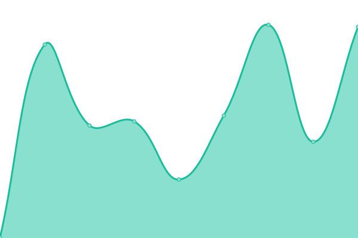 321ms
     
 | 

<a href="https://uptime.kind.work/history/david-cohlmeyer">100.00%</a>
    

|  [Don Foulds](https://donfoulds.com) | 🟩 Up | [don-foulds.yml](https://github.com/kind-work/uptime/commits/HEAD/history/don-foulds.yml) | 

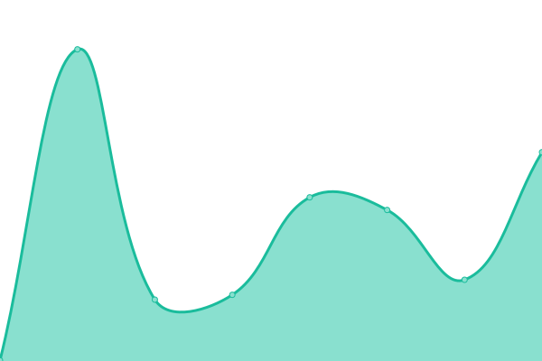 251ms
     
 | 

<a href="https://uptime.kind.work/history/don-foulds">100.00%</a>
    

|  [Elegoa](https://elegoa.com) | 🟩 Up | [elegoa.yml](https://github.com/kind-work/uptime/commits/HEAD/history/elegoa.yml) | 

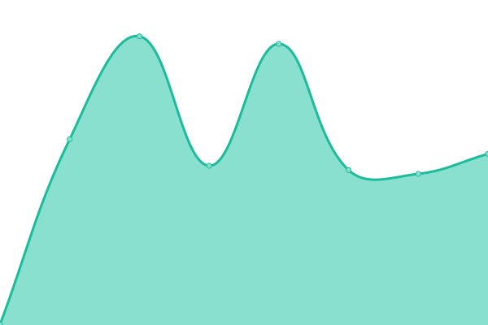 429ms
     
 | 

<a href="https://uptime.kind.work/history/elegoa">100.00%</a>
    

|  [Ginok Song](https://ginoksong.com) | 🟩 Up | [ginok-song.yml](https://github.com/kind-work/uptime/commits/HEAD/history/ginok-song.yml) | 

 383ms
     
 | 

<a href="https://uptime.kind.work/history/ginok-song">100.00%</a>
    

|  [Jake Butineau](https://jakebutineau.ca) | 🟩 Up | [jake-butineau.yml](https://github.com/kind-work/uptime/commits/HEAD/history/jake-butineau.yml) | 

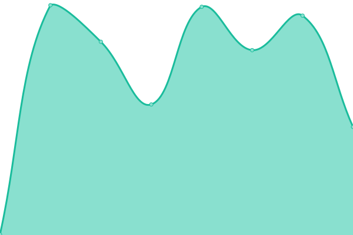 323ms
     
 | 

<a href="https://uptime.kind.work/history/jake-butineau">100.00%</a>
    

|  [Jonathan Cohlmeyer Dev](https://jonathan.cohlmeyer.dev) | 🟩 Up | [jonathan-cohlmeyer-dev.yml](https://github.com/kind-work/uptime/commits/HEAD/history/jonathan-cohlmeyer-dev.yml) | 

 410ms
     
 | 

<a href="https://uptime.kind.work/history/jonathan-cohlmeyer-dev">100.00%</a>
    

|  [JRC9](https://jrc9.ca) | 🟩 Up | [jrc-9.yml](https://github.com/kind-work/uptime/commits/HEAD/history/jrc-9.yml) | 

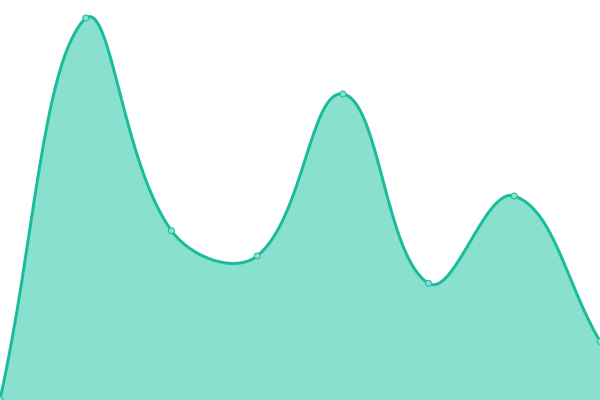 280ms
     
 | 

<a href="https://uptime.kind.work/history/jrc-9">100.00%</a>
    

|  [Lissa M Cowan](https://lissamcowan.com) | 🟩 Up | [lissa-m-cowan.yml](https://github.com/kind-work/uptime/commits/HEAD/history/lissa-m-cowan.yml) | 

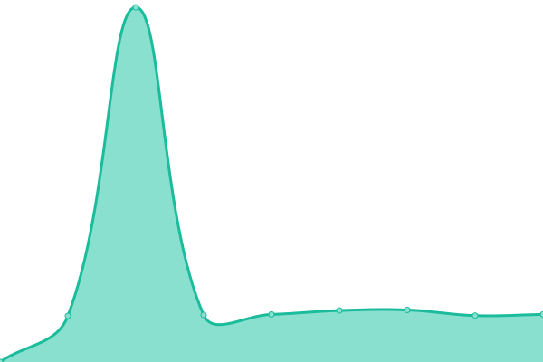 447ms
     
 | 

<a href="https://uptime.kind.work/history/lissa-m-cowan">100.00%</a>
    

|  [Museums Hamilton](https://museumshamilton.com) | 🟩 Up | [museums-hamilton.yml](https://github.com/kind-work/uptime/commits/HEAD/history/museums-hamilton.yml) | 

 415ms
     
 | 

<a href="https://uptime.kind.work/history/museums-hamilton">100.00%</a>
    

|  [Silverlynks](https://silverlynks.ca) | 🟩 Up | [silverlynks.yml](https://github.com/kind-work/uptime/commits/HEAD/history/silverlynks.yml) | 

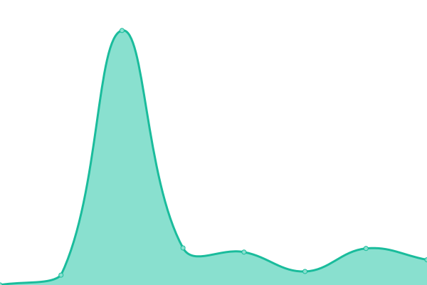 285ms
     
 | 

<a href="https://uptime.kind.work/history/silverlynks">100.00%</a>
    

|  [Synthescape App](https://app.synthescape.com) | 🟩 Up | [synthescape-app.yml](https://github.com/kind-work/uptime/commits/HEAD/history/synthescape-app.yml) | 

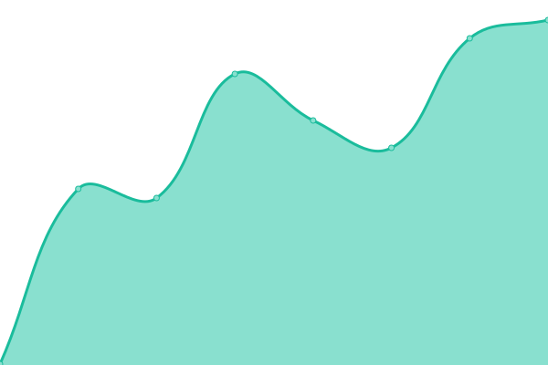 264ms
     
 | 

<a href="https://uptime.kind.work/history/synthescape-app">100.00%</a>
    

|  [Synthescape](https://www.synthescape.com) | 🟩 Up | [synthescape.yml](https://github.com/kind-work/uptime/commits/HEAD/history/synthescape.yml) | 

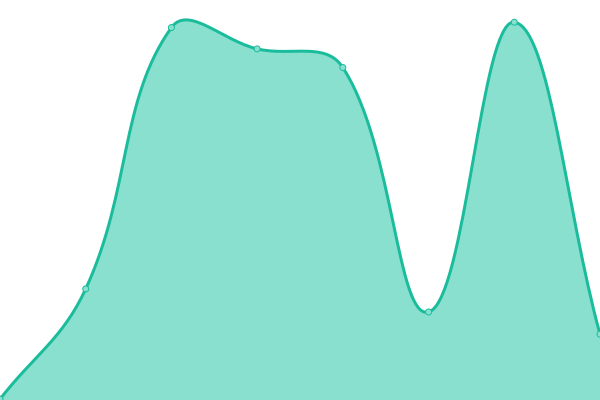 269ms
     
 | 

<a href="https://uptime.kind.work/history/synthescape">100.00%</a>
    

|  [The New Common](https://thenewcommon.org) | 🟩 Up | [the-new-common.yml](https://github.com/kind-work/uptime/commits/HEAD/history/the-new-common.yml) | 

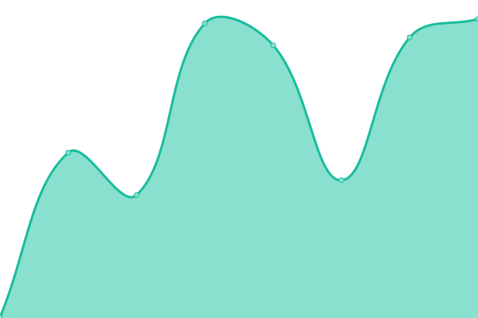 320ms
     
 | 

<a href="https://uptime.kind.work/history/the-new-common">100.00%</a>
    

|  [Trinity Life](https://trinitylife.ca) | 🟩 Up | [trinity-life.yml](https://github.com/kind-work/uptime/commits/HEAD/history/trinity-life.yml) | 

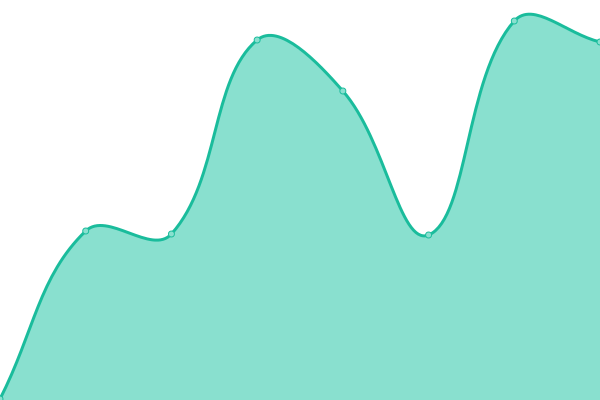 251ms
     
 | 

<a href="https://uptime.kind.work/history/trinity-life">100.00%</a>
    

|  [Umista Potlatch](https://umistapotlatch.ca) | 🟩 Up | [umista-potlatch.yml](https://github.com/kind-work/uptime/commits/HEAD/history/umista-potlatch.yml) | 

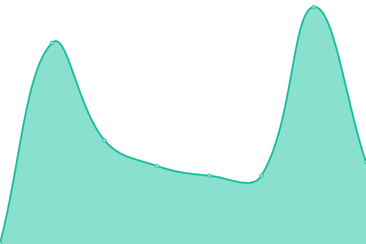 275ms
     
 | 

<a href="https://uptime.kind.work/history/umista-potlatch">100.00%</a>
    

|  [Wesley Harris](https://wesleyharris.ca) | 🟩 Up | [wesley-harris.yml](https://github.com/kind-work/uptime/commits/HEAD/history/wesley-harris.yml) | 

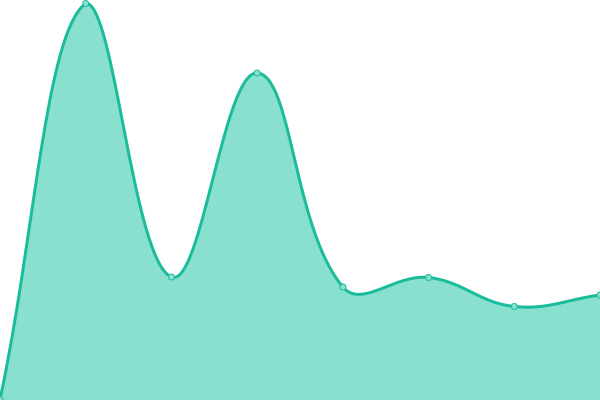 517ms
     
 | 

<a href="https://uptime.kind.work/history/wesley-harris">100.00%</a>
    

|  [Wild Eats](https://wildeats.ca/blog) | 🟩 Up | [wild-eats.yml](https://github.com/kind-work/uptime/commits/HEAD/history/wild-eats.yml) | 

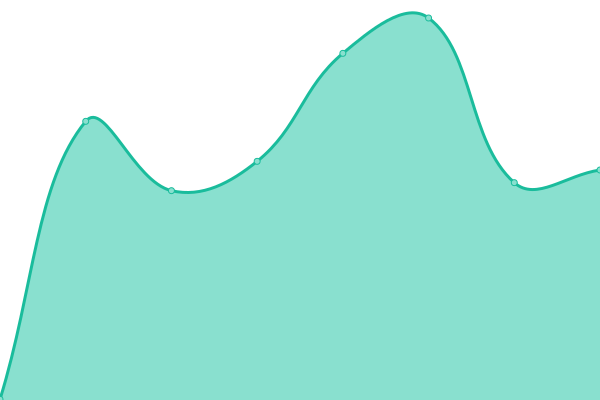 439ms
     
 | 

<a href="https://uptime.kind.work/history/wild-eats">100.00%</a>
    

<!--end: status pages-->

[**Visit our status website →**](https://uptime.kind.work)

## 📄 License

- Powered by: [Upptime](https://github.com/upptime/upptime)
- Code: [MIT](./LICENSE) © [Kind.Work](https://uptime.kind.work)
- Data in the `./history` directory: [Open Database License](https://opendatacommons.org/licenses/odbl/1-0/)
