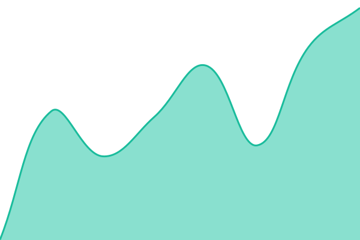
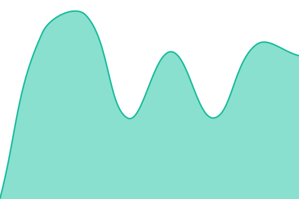
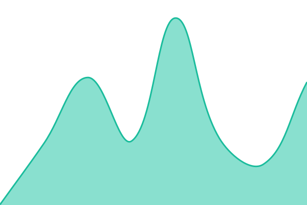
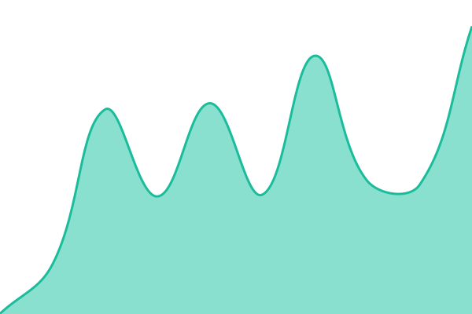
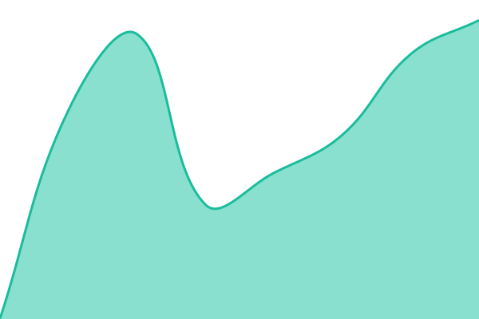
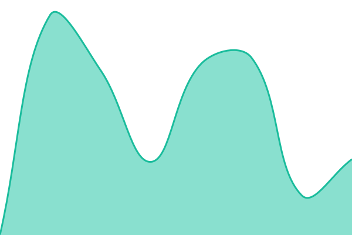
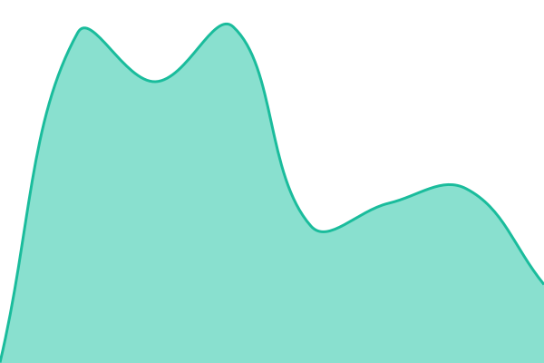
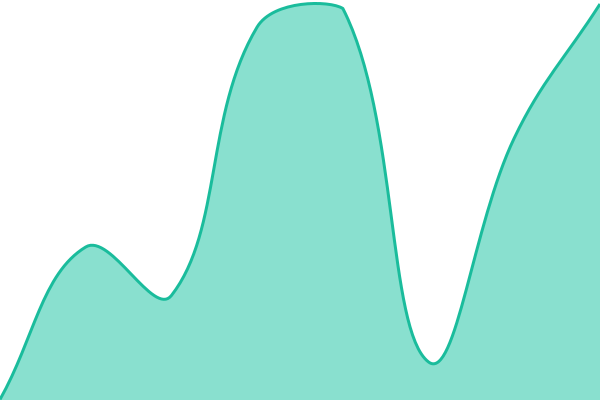

# [📈 Live Status](https://uptime.kind.work): <!--live status--> **🟩 All systems operational**

This repository contains the open-source uptime monitor and status page for [Upptime](https://upptime.js.org), powered by [Upptime](https://github.com/upptime/upptime).

With [Upptime](https://upptime.js.org), you can get your own unlimited and free uptime monitor and status page, powered entirely by a GitHub repository. We use [Issues](https://github.com/upptime/upptime/issues) as incident reports, [Actions](https://github.com/kind-work/uptime/actions) as uptime monitors, and [Pages](https://uptime.kind.work) for the status page.

<!--start: status pages-->
<!-- This summary is generated by Upptime (https://github.com/upptime/upptime) -->
<!-- Do not edit this manually, your changes will be overwritten -->
<!-- prettier-ignore -->
| URL | Status | History | Response Time | Uptime |
| --- | ------ | ------- | ------------- | ------ |
|  [Agri Food Hub](https://agrifoodhub.org) | 🟩 Up | [agri-food-hub.yml](https://github.com/kind-work/uptime/commits/HEAD/history/agri-food-hub.yml) | 

 438ms
     
 | 

<a href="https://uptime.kind.work/history/agri-food-hub">100.00%</a>
    

|  [Cindy Thompson](https://cindythompson.ca) | 🟩 Up | [cindy-thompson.yml](https://github.com/kind-work/uptime/commits/HEAD/history/cindy-thompson.yml) | 

 401ms
     
 | 

<a href="https://uptime.kind.work/history/cindy-thompson">100.00%</a>
    

|  [David Cohlmeyer](https://davidcohlmeyer.ca) | 🟩 Up | [david-cohlmeyer.yml](https://github.com/kind-work/uptime/commits/HEAD/history/david-cohlmeyer.yml) | 

 580ms
     
 | 

<a href="https://uptime.kind.work/history/david-cohlmeyer">100.00%</a>
    

|  [Don Foulds](https://donfoulds.com) | 🟩 Up | [don-foulds.yml](https://github.com/kind-work/uptime/commits/HEAD/history/don-foulds.yml) | 

 370ms
     
 | 

<a href="https://uptime.kind.work/history/don-foulds">100.00%</a>
    

|  [Elegoa](https://elegoa.com) | 🟩 Up | [elegoa.yml](https://github.com/kind-work/uptime/commits/HEAD/history/elegoa.yml) | 

 617ms
     
 | 

<a href="https://uptime.kind.work/history/elegoa">100.00%</a>
    

|  [Jonathan Cohlmeyer Dev](https://jonathan.cohlmeyer.dev) | 🟩 Up | [jonathan-cohlmeyer-dev.yml](https://github.com/kind-work/uptime/commits/HEAD/history/jonathan-cohlmeyer-dev.yml) | 

 830ms
     
 | 

<a href="https://uptime.kind.work/history/jonathan-cohlmeyer-dev">100.00%</a>
    

|  [JRC9](https://jrc9.ca) | 🟩 Up | [jrc-9.yml](https://github.com/kind-work/uptime/commits/HEAD/history/jrc-9.yml) | 

 449ms
     
 | 

<a href="https://uptime.kind.work/history/jrc-9">100.00%</a>
    

|  [Silverlynks](https://silverlynks.ca) | 🟩 Up | [silverlynks.yml](https://github.com/kind-work/uptime/commits/HEAD/history/silverlynks.yml) | 

 624ms
     
 | 

<a href="https://uptime.kind.work/history/silverlynks">100.00%</a>
    

|  [Umista Potlatch](https://umistapotlatch.ca) | 🟩 Up | [umista-potlatch.yml](https://github.com/kind-work/uptime/commits/HEAD/history/umista-potlatch.yml) | 

 361ms
     
 | 

<a href="https://uptime.kind.work/history/umista-potlatch">100.00%</a>
    

|  [Wesley Harris](https://wesleyharris.ca) | 🟩 Up | [wesley-harris.yml](https://github.com/kind-work/uptime/commits/HEAD/history/wesley-harris.yml) | 

 672ms
     
 | 

<a href="https://uptime.kind.work/history/wesley-harris">100.00%</a>
    

|  [Coara Marie](https://coramarie.ca) | 🟩 Up | [coara-marie.yml](https://github.com/kind-work/uptime/commits/HEAD/history/coara-marie.yml) | 

 674ms
     
 | 

<a href="https://uptime.kind.work/history/coara-marie">100.00%</a>
    

<!--end: status pages-->

[**Visit our status website →**](https://uptime.kind.work)

## 📄 License

- Powered by: [Upptime](https://github.com/upptime/upptime)
- Code: [MIT](./LICENSE) © [Upptime](https://upptime.js.org)
- Data in the `./history` directory: [Open Database License](https://opendatacommons.org/licenses/odbl/1-0/)
